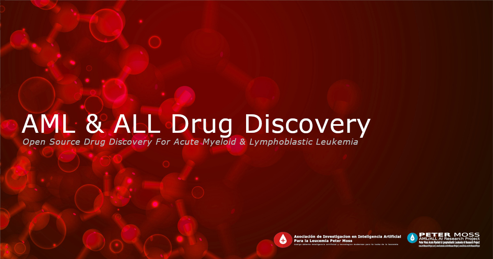

# Peter Moss Acute Myeloid & Lymphoblastic Leukemia AI Research Project
## AML & ALL Drug Discovery

   

  

 

&nbsp;

**THIS PROJECT IS CURRENTLY IN DEVELOPMENT**

&nbsp;

# Introduction

**DEVELOPER TO ADD ABSTRACT**

&nbsp;

# DISCLAIMER

_This project should be used for research purposes only. The purpose of the project is to show the potential of Artificial Intelligence for medical support systems such as drug discovery._

&nbsp;

# Motivation

**DEVELOPER TO ADD MOTIVATION**

&nbsp;

# Acute Myeloid Leukemia
[Acute myeloid leukemia (AML)](https://www.leukemiaairesearch.com/research/leukemia), is a blood cancer caused by uncontrolled proliferation of abnormal myeloid precursor cells. It accounts for approximately 90% of all acute leukemias in adults. The incidence of AML increases with age. Most patients with AML are aged 65 years and over. Only 6% of patients, more or less, are younger than 20 years. AML prognosis is very poor, with a 5-year survival of < 10% in patients older than 60 years at diagnosis. The prognosis is better in younger patients.

# Acute Lymphoblastic Leukemia
[Acute lymphoblastic leukemia (ALL)](https://www.leukemiaairesearch.com/research/leukemia), also known as Acute Lymphocytic Leukemia, is a cancer that affects the lymphoid blood cell lineage. It is the most common leukemia in children, and it accounts for 10-20% of acute leukemias in adults. The prognosis for both adult and especially childhood ALL has improved substantially since the 1970s. The 5- year survival is approximately 95% in children. In adults, the 5-year survival varies between 25% and 75%, with more favorable results in younger than in older patients.

For more information about Acute Lymphoblastic Leukemia  please visit our [Leukemia Information Page](https://www.leukemiaairesearch.com/research/leukemia)

&nbsp;

# Drug Discovery

**DEVELOPER TO EXPLAIN DRUG DISCOVERY**

For more information about drug discovery, please feel free to read the following articles:

- [AML Drug Discovery Background](information/aml-drug-discovery-background.md) - [Prof. Ho Leung Ng](https://www.leukemiaairesearch.com/association/volunteers/alumni/ho-leung-ng)
- [Activating new sting activators](information/activating-new-sting-activators.md) - [Prof. Ho Leung Ng](https://www.leukemiaairesearch.com/association/volunteers/alumni/ho-leung-ng)

&nbsp;

# Getting Started

To get started follow the [official documentation](docs/index.md).

&nbsp;

# Contributing
Asociación de Investigacion en Inteligencia Artificial Para la Leucemia Peter Moss encourages and welcomes code contributions, bug fixes and enhancements from the Github community.

Please read the [CONTRIBUTING](https://github.com/AMLResearchProject/Contributing-Guide/blob/main/CONTRIBUTING.md "CONTRIBUTING") document for a full guide to contributing to our research project. You will also find our code of conduct in the [Code of Conduct](https://github.com/AMLResearchProject/Contributing-Guide/blob/main/CODE-OF-CONDUCT.md) document.

## Contributors
- [Javier Lopez Alonso](https://www.leukemiaairesearch.com/association/volunteers/javier-lopez-alonso "Javier Lopez Alonso") - [Asociación de Investigacion en Inteligencia Artificial Para la Leucemia Peter Moss](https://www.leukemiaresearchassociation.ai "Asociación de Investigacion en Inteligencia Artificial Para la Leucemia Peter Moss") Treasurer, Barcelona, Spain
- [Prof. Ho Leung Ng](https://www.leukemiaairesearch.com/association/volunteers/alumni/ho-leung-ng "Prof. Ho Leung Ng") - [Asociación de Investigacion en Inteligencia Artificial Para la Leucemia Peter Moss](https://www.leukemiaresearchassociation.ai "Asociación de Investigacion en Inteligencia Artificial Para la Leucemia Peter Moss") Alumni, Kansas, USA

&nbsp;

# Versioning
We use [SemVer](https://semver.org/) for versioning.

&nbsp;

# License
This project is licensed under the **MIT License** - see the [LICENSE](LICENSE "LICENSE") file for details.

&nbsp;

# Bugs/Issues
We use the [repo issues](issues "repo issues") to track bugs and general requests related to using this project. See [CONTRIBUTING](https://github.com/AMLResearchProject/Contributing-Guide/blob/main/CONTRIBUTING.md "CONTRIBUTING") for more info on how to submit bugs, feature requests and proposals.