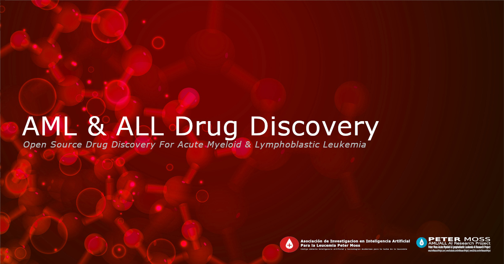

# Documentation

# Welcome

Welcome to the **AML & ALL Drug Discovery** official documentation.

DEVELOPER TO EXPLAIN/UPDATE THE PROJECT DETAILS

&nbsp;

# Installation

Head over to the [Ubuntu Installation Guide](installation/ubuntu.md) for a complete installation guide.

&nbsp;

# Usage

Head over to the [Ubuntu Usage Guide](usage/ubuntu.md) for a complete usage guide.

&nbsp;

# Contributing
Asociación de Investigacion en Inteligencia Artificial Para la Leucemia Peter Moss encourages and welcomes code contributions, bug fixes and enhancements from the Github community.

Please read the [CONTRIBUTING](https://github.com/AMLResearchProject/Contributing-Guide/blob/main/CONTRIBUTING.md "CONTRIBUTING") document for a full guide to contributing to our research project. You will also find our code of conduct in the [Code of Conduct](https://github.com/AMLResearchProject/Contributing-Guide/blob/main/CODE-OF-CONDUCT.md) document.

## Contributors
- [Javier Lopez Alonso](https://www.leukemiaairesearch.com/association/volunteers/javier-lopez-alonso "Javier Lopez Alonso") - [Asociación de Investigacion en Inteligencia Artificial Para la Leucemia Peter Moss](https://www.leukemiaresearchassociation.ai "Asociación de Investigacion en Inteligencia Artificial Para la Leucemia Peter Moss") Treasurer, Barcelona, Spain

&nbsp;

# Versioning
We use [SemVer](https://semver.org/) for versioning.

&nbsp;

# License
This project is licensed under the **MIT License** - see the [LICENSE](https://github.com/AMLResearchProject/AML-ALL-Drug-Discovery/blob/main/LICENSE "LICENSE") file for details.

&nbsp;

# Bugs/Issues
We use the [repo issues](https://github.com/AMLResearchProject/AML-ALL-Drug-Discovery/issues "repo issues") to track bugs and general requests related to using this project. See [CONTRIBUTING](https://github.com/AMLResearchProject/Contributing-Guide/blob/main/CONTRIBUTING.md "CONTRIBUTING") for more info on how to submit bugs, feature requests and proposals.