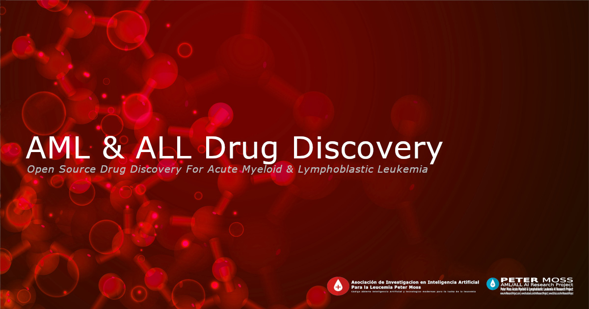

# Ubuntu Installation



# Introduction
This guide will guide you through the installation process for the **AML & ALL Drug Discovery** Project.

<font color='red'>DEVELOPER TO EXPLAIN/UPDATE THE PROJECT DETAILS</font>

&nbsp;

# Prerequisites
You will need to ensure you have the following prerequisites installed and setup.

<font color='red'>DEVELOPER TO EXPLAIN/UPDATE THE PREQUISITE DETAILS</font>

&nbsp;

# Operating System
The AML & ALL Drug Discovery Jupyter Notebook supports the following operating system(s).

<font color='red'>DEVELOPER TO LIST COMPATIBLE OPERATING SYSTEM(S). MUST BE TESTED BEFORE LISTING</font>

&nbsp;

# Software
The AML & ALL Drug Discovery Jupyter Notebook project uses the following libraries.

<font color='red'>DEVELOPER TO LIST SOFTWARE LIBRARIES USED</font>

&nbsp;

# Installation
You are now ready to install the AML & ALL Drug Discovery Project.

## Clone the repository

Clone the [AML & ALL Drug Discovery](https://github.com/AMLResearchProject/AML-ALL-Drug-Discovery " AML & ALL Drug Discovery") repository from the [Peter Moss Acute Myeloid & Lymphoblastic Leukemia AI Research Project](https://github.com/AMLResearchProject "Peter Moss Acute Myeloid & Lymphoblastic Leukemia AI Research Project") Github Organization.

To clone the repository and install the project, make sure you have Git installed. Now navigate to the directory you would like to clone the project to and then use the following command.

``` bash
 git clone https://github.com/AMLResearchProject/AML-ALL-Drug-Discovery.git
```

This will clone the AML & ALL Drug Discovery repository.

``` bash
 ls
```

Using the ls command in your home directory should show you the following.

``` bash
 AML-ALL-Drug-Discovery
```

Navigate to the **AML-ALL-Drug-Discovery** directory, this is your project root directory for this tutorial.

### Developer forks

Developers from the Github community that would like to contribute to the development of this project should first create a fork, and clone that repository. For detailed information please view the [CONTRIBUTING](https://github.com/AMLResearchProject/Contributing-Guide/blob/main/CONTRIBUTING.md "CONTRIBUTING") guide. You should pull the latest code from the development branch.

``` bash
 git clone -b "1.0.0" https://github.com/AMLResearchProject/AML-ALL-Drug-Discovery.git
```

The **-b "1.0.0"** parameter ensures you get the code from the latest master branch. Before using the below command please check our latest master branch in the button at the top of the project README.

## Installation script
All software requirements are included in **scripts/install.sh**. You can run this file on your machine from the project root in terminal. Use the following command:

 sh scripts/install.sh

<font color='red'>DEVELOPER TO PROVIDE FULL INSTALLATION INSTRUCTIONS</font>

&nbsp;

## Configuration

All configuration can be found in the **configuration/config.json** file.

<font color='red'>DEVELOPER TO EDIT CONFIG FILE AND PROVIDE FULL DESCRIPTION OF CONFIGURATION</font>

&nbsp;

# Contributing
Asociación de Investigacion en Inteligencia Artificial Para la Leucemia Peter Moss encourages and welcomes code contributions, bug fixes and enhancements from the Github community.

Please read the [CONTRIBUTING](https://github.com/AMLResearchProject/Contributing-Guide/blob/main/CONTRIBUTING.md "CONTRIBUTING") document for a full guide to contributing to our research project. You will also find our code of conduct in the [Code of Conduct](https://github.com/AMLResearchProject/Contributing-Guide/blob/main/CODE-OF-CONDUCT.md) document.

## Contributors
- [Sumeet Vyas](https://www.leukemiaairesearch.com/association/volunteers/sumeet-vyas "Sumeet Vyas") - [Asociación de Investigacion en Inteligencia Artificial Para la Leucemia Peter Moss](https://www.leukemiaresearchassociation.ai "Asociación de Investigacion en Inteligencia Artificial Para la Leucemia Peter Moss") Deep Learning Engineer, Pune, India

&nbsp;

# Versioning
We use [SemVer](https://semver.org/) for versioning.

&nbsp;

# License
This project is licensed under the **MIT License** - see the [LICENSE](https://github.com/AMLResearchProject/AML-ALL-Drug-Discovery/blob/main/LICENSE "LICENSE") file for details.

&nbsp;

# Bugs/Issues
We use the [repo issues](https://github.com/AMLResearchProject/AML-ALL-Drug-Discovery/issues "repo issues") to track bugs and general requests related to using this project. See [CONTRIBUTING](https://github.com/AMLResearchProject/Contributing-Guide/blob/main/CONTRIBUTING.md "CONTRIBUTING") for more info on how to submit bugs, feature requests and proposals.