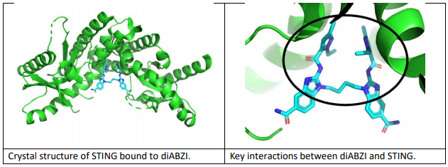

# Peter Moss Acute Myeloid & Lymphoblastic Leukemia AI Research Project
## AML & ALL Drug Discovery

&nbsp;

# Identifying new STING activators

## Ho Leung Ng, Kansas State University

One of the most promising immunostimulatory drug targets is STING (STimulator of INterferon Genes). STING is normally activated by cyclic dinucleotides as part of the innate immune response.

STING activation has been shown to be therapeutically effective in a mouse model of AML (Curran et al., 2016, 2015). Molecules currently used in as STING activators in research lack chemical properties necessary for a clinical drug, such as metabolic stability. In particular, drugs that do not share chemical similarities to cyclic dinucleotides are desired for systemic administration. The first reported STING activator with such chemical properties was reported in December 2018 by the pharmaceutical company GSK and was shown to be active in a mouse model of colon cancer (Ramanjulu et al., 2018). We seek to identify other non-cyclic dinucleotide STING activators with favorable chemical properties for drug discovery.

I used the crystal structure of STING bound to the compound reported by Ramanjulu et al (PDB 6dxl) (diABZI) to identify other molecule with similar chemical interactions with STING. I used Pharmit to search the Chemspace database of 50M purchasable compounds to identify a subset that preserve key
interactions observed between diABZI and STING. I identified a set of 454,430 molecules for more detailed analysis. I plan to analyze this dataset using docking and machine learning based scoring functions.

Curran, E., Chen, X., Corrales, L., Kline, D.E., Dubensky, T.W., Duttagupta, P., Kortylewski, M., Kline, J., 2016. STING Pathway Activation Stimulates Potent Immunity against Acute Myeloid Leukemia.

Cell Reports 15, 2357–2366. https://doi.org/10.1016/j.celrep.2016.05.023

Curran, E., Corrales, L., Kline, J., 2015. Targeting the Innate Immune System as Immunotherapy for Acute Myeloid Leukemia.

Front. Oncol. 5. https://doi.org/10.3389/fonc.2015.00083

Ramanjulu, J.M., Pesiridis, G.S., Yang, J., Concha, N., Singhaus, R., Zhang, S.-Y., Tran, J.-L., Moore, P., Lehmann, S., Eberl, H.C., Muelbaier, M., Schneck, J.L., Clemens, J., Adam, M., Mehlmann, J., Romano, J., Morales, A., Kang, J., Leister, L., Graybill, T.L., Charnley, A.K., Ye, G., Nevins, N., Behnia, K., Wolf, A.I., Kasparcova, V., Nurse, K., Wang, L., Li, Y., Klein, M., Hopson, C.B., Guss, J., Bantscheff, M., Bergamini, G., Reilly, M.A., Lian, Y., Duffy, K.J., Adams, J., Foley, K.P., Gough, P.J., Marquis, R.W., Smothers, J., Hoos, A., Bertin, J., 2018. Design of amidobenzimidazole STING receptor agonists with systemic activity.

Nature 564, 439. https://doi.org/10.1038/s41586-018-0705-y

&nbsp;

# Contributing
Asociación de Investigacion en Inteligencia Artificial Para la Leucemia Peter Moss encourages and welcomes code contributions, bug fixes and enhancements from the Github community.

Please read the [CONTRIBUTING](https://github.com/AMLResearchProject/Contributing-Guide/blob/main/CONTRIBUTING.md "CONTRIBUTING") document for a full guide to contributing to our research project. You will also find our code of conduct in the [Code of Conduct](https://github.com/AMLResearchProject/Contributing-Guide/blob/main/CODE-OF-CONDUCT.md) document.

## Contributors
- [Prof. Ho Leung Ng](https://www.leukemiaairesearch.com/association/volunteers/alumni/ho-leung-ng "Prof. Ho Leung Ng") - [Asociación de Investigacion en Inteligencia Artificial Para la Leucemia Peter Moss](https://www.leukemiaresearchassociation.ai "Asociación de Investigacion en Inteligencia Artificial Para la Leucemia Peter Moss") Alumni, Kansas, USA

&nbsp;

# Versioning
We use [SemVer](https://semver.org/) for versioning.

&nbsp;

# License
This project is licensed under the **MIT License** - see the [LICENSE](../LICENSE "LICENSE") file for details.

&nbsp;

# Bugs/Issues
We use the [repo issues](../issues "repo issues") to track bugs and general requests related to using this project. See [CONTRIBUTING](https://github.com/AMLResearchProject/Contributing-Guide/blob/main/CONTRIBUTING.md "CONTRIBUTING") for more info on how to submit bugs, feature requests and proposals.