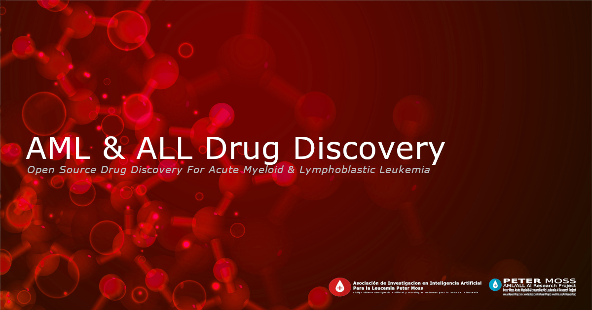

# Peter Moss Acute Myeloid & Lymphoblastic Leukemia AI Research Project
## AML & ALL Drug Discovery

&nbsp;

# AML (acute myeloid leukemia) drug discovery background

## Ho Leung Ng, Kansas State University

AML remains a difficult disease to treat. More than other leukemias, it consists of a broad range of different subtypes that differ at the microscopic and genetic level. These subtypes have different prognoses and therapies.

Chemotherapy agents can generally be divided into three classes: 1) cytotoxic and non-targeted, 2) targeted, and 3) immunomodulatory. Drugs from all three classes are used to treat AML.

Non-targeted, cytotoxic agents remain the foundation of AML treatment. These drugs are older and are what most lay people think of when they hear the term, “chemotherapy”. These drugs are toxic. Cancer cells, because of their high growth and metabolic rates, are more sensitive to cytotoxic drugs. In AML, they are used to quickly reduce the numbers of leukemic cells, providing quick symptom relief and are sometimes effective long-term treatment. Their toxicity limits their use for older, sicker patients. The most commonly used cytotoxic drugs for AML include cytarabine (ara-C) and anthracyclines (daunorubicin and idarubicin). In many cases, the leukemia eventually develops resistance to the drug, and the patient relapses. Key research goals include 1) discovery of new cytotoxic agents that work by new mechanisms, 2) discovery of less toxic variants of current cytotoxic drugs, 3) discovery of drugs for which drug resistance is less likely to develop or are effective in cases of drug resistant leukemia. A possible computational approach for the AML AI drug discovery group is to identify new molecules that are chemically similar to those known to be chemically active. We can use ML to select for molecules less likely to be associated with toxicity or drug resistance.

Most current cancer drug research is on the discovery of targeted drugs. Targeted drugs are usually
designed to block (in most cases) or activate a specific target protein. The targets are proteins that are either mutated or overexpressed in the cancer relative to normal cells. Targeted drugs are usually less toxic than cytotoxic drugs. If the proper target for a cancer is identified, targeted drugs can be extremely effective. Much research is required to properly identify potential targets for each subtype of cancer. For AML, the different subtypes are usually associated with distinct sets of targets. A good starting point to learn about AML targets is the Tyner et al paper published in 2018 in Nature v562, 526. Once a target is identified, researchers usually experimentally screen thousands of compounds to identify those that are active in an approach called high-throughput screening. This is too costly for all but drug companies and a few highly resourced academic labs. Alternatively, if the 3D structure of the target protein is known, one can computationally screen compounds by calculating their chemical fit to the binding site. The highest scoring compounds are tested experimentally. One can apply ML methods and develop new ways of scoring compounds.

Immunomodulatory drugs stimulate the immune system to attack cancer. For AML, IDO (indoleamine 2,3-dioxgenase) inhibitors have recently been approved for treatment. No other immunomodulatory drugs have been established as effective against AML, but this is an area of very active research.

Potential projects would be to identify new molecules active against known immunomodulatory targets
using the approaches described previously.

&nbsp;

# Ideas for potential projects:

1. Discovery of anthracyclines that are predicted to be less cardiotoxic.
2. Discovery of anthracyclines that are predicted to be less associated with drug resistance.
3. Identify new AML targets from the Tyner et al paper, especially those which have only been lightly
   studied. Find molecules to block these targets.
4. Choose immunomodulatory targets such as STING. Identify new bioactive molecules for these targets.
5. Develop models that can predict cardiotoxicity based on chemical structure of drugs.

&nbsp;

# Contributing

The Peter Moss Leukemia Research Foundation & Peter Moss Acute Myeloid & Lymphoblastic Leukemia AI Research project encourages and welcomes code contributions, bug fixes and enhancements from the Github community.

Please read the [CONTRIBUTING](https://github.com/AMLResearchProject/AML-ALL-Drug-Discovery/blob/master/CONTRIBUTING.md "CONTRIBUTING") document for a full guide to forking our repositories and submitting your pull requests. You will also find information about our code of conduct on this page.

## Team Contributors

The following Peter Moss Acute Myeloid & Lymphoblastic Leukemia AI Research project team members have contributed towards this repository:

- [Ho Leung Ng](https://www.leukemiaresearchfoundation.ai/team/ho-leung-ng/profile "Ho Leung Ng") - Peter Moss Leukemia Research Foundation. Kansas, USA

&nbsp;

# Versioning

We use SemVer for versioning. For the versions available, see [Releases](https://github.com/AMLResearchProject/AML-ALL-Drug-Discovery/releases "Releases").

# License

This project is licensed under the **MIT License** - see the [LICENSE](https://github.com/AMLResearchProject/AML-ALL-Drug-Discovery/blob/master/LICENSE.md "LICENSE") file for details.

# Bugs/Issues

We use the [repo issues](https://github.com/AMLResearchProject/AML-ALL-Drug-Discovery/issues "repo issues") to track bugs and general requests related to using this project.

